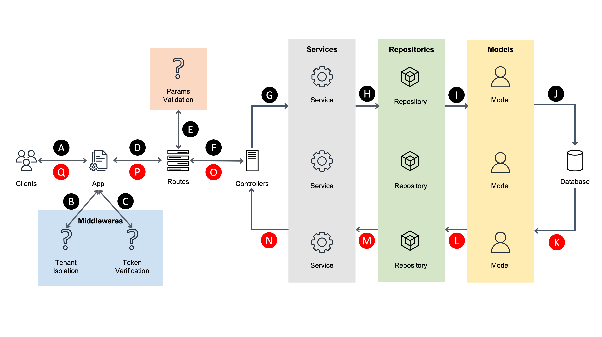

<p align="center">
  <!--  -->
  <h1 align="center">ISO Server</h1>
</p>
<br/>

## 🗒 개요
---------------
이 프로젝트는 ISOS의 MES(생산관리시스템) 프로그램인 ISO의 Server 프로젝트입니다. 

❗️ 개발환경(Production / Development / Test)별로  

아래의 모듈을 포함하고 있습니다.

| Initial | Name | Name(En) | Desciprtion |
|:----------:|:----------|:----------|:----------|
| `ADM` | 관리자 | Admin | 관리자 옵션 및 기준정보를 관리합니다. |
| `AUT` | 인증/인가 | Authentication/Authorization | 사용자 및 권한, 인증에 관련된 정보를 관리합니다. |
| `STD` | 기준정보 | Standard | ISO의 기초 데이터인 기준정보를 관리합니다. |
| `MAT` | 자재/구매관리 | Material | 자재의 구매와 재고를 관리합니다. |
| `PRD` | 생산관리 | Production | 제품의 생산에 관련된 정보를 관리합니다. |
| `EQM` | 설비관리 | Equipment | 공장의 설비 데이터를 관리합니다. |
| `MLD` | 금형관리 | Mold | 공장의 금형 데이터를 관리합니다. |
| `INV` | 재고관리 | Inventory | 전사의 모든 재고 데이터를 관리합니다. |
| `OUT` | 외주관리 | Outsourcing | 협력사와 관련된 외주 데이터를 관리합니다. |
| `QMS` | 품질관리 | Quality | 수입검사, 공정검사, 최종검사등 품질에 관련된 데이터를 관리합니다. |
| `SAL` | 제품/영업관리 | Sales | 제품의 판매와 재고를 관리합니다. |
<br/>

## 👉 Version
---------------
- Lastest: v0.1.0 (2022-02-07)
  
<br/>

## ✏️ API Document
---------------
- [Postman ISO Server](https://documenter.getpostman.com/view/9912559/UVeGs6KA)

<br/>

## 1️⃣ Modules
---------------
| Module | Version | Description |
|:----------|:----------:|:----------|
| `typescript` | `^4.2.3` | Typescript Module |
| `ts-node` | `^9.1.1` | Typescript 파일 실행 Module |
| `axios` | `^0.24.0` | Http Connect Module |
| `babel-plugin-istanbul` | `^6.0.0` | ES6 관련 Module |
| `babel-plugin-transform-decorators-legacy` | `^1.3.5` | ES6 관련 Module |
| `babel-plugin-transform-runtime` | `^6.23.0` | ES6 관련 Module |
| `babel-preset-es2015-node6` | `^0.4.0` | ES6 관련 Module |
| `babel-preset-minify` | `^0.5.1` | ES6 관련 Module |
| `bcrypt` | `^5.0.1` | 단방향 암호화 Module |
| `cookie-parser` | `^1.4.5` | Express에서 Cookie를 쉽게 사용할 수 있는 Module |
| `cors` | `^2.8.5` | Cross Origin Resource Sharing 설정 Module |
| `crypto-js` | `^4.0.0` | 양방향 암호화 Module |
| `dotenv` | `^8.2.0` | 환경변수를 Code Level에서 쉽게 사용할 수 있는 Module(.env) |
| `esm` | `^3.2.25` | Typescript에서 export문법을 사용할 수 있는 Module |
| `express` | `^4.17.1` | Http Server Module |
| `express-async-errors` | `^3.1.1` | Express의 비동기 Error Handling Module |
| `express-validator` | `^6.14.0` | Express의 유효성검사 Middleware Module |
| `fs` | `^0.0.1-security` | File Stream Module |
| `http-status` | `^1.5.0` | Http Response Module |
| `jest` | `^26.6.3` | Testing Module |
| `jsonwebtoken` | `^8.5.1` | JWT(Json Web Token) 사용 Module |
| `lodash` | `^4.17.21` | 데이터 구조를 편하게 다룰 수 있는 Module |
| `moment` | `^2.29.1` | 시간을 편하게 다룰 수 있는 Module |
| `morgan` | `^1.10.0` | Logging Module |
| `pg` | `^8.6.0` | Postgresql(RDBMS) Module |
| `redis` | `^3.1.2` | Redis(Cache Database) Module |
| `reflect-metadata` | `^0.1.13` | Sequelize-Typescript 종속 Module |
| `sequelize` | `^6.6.2` | ORM(Object Relational Mapping) Module |
| `sequelize-cli` | `^6.2.0` | Sequelize의 CLI(Command Line Interface) Module |
| `sequelize-typescript` | `^2.1.0` | Sequelize의 Typescript Version Module |
| `supertest` | `^6.1.3` | Testing Module |
| `tsc-watch` | `^4.2.9` | 개발환경에서 파일이 업데이트 될 때마다 재 컴파일을 시켜주는 Module |
| `uuid` | `^8.3.2` | UUID를 생성 및 관리할 수 있는 Module |
| `winston` | `^3.3.3` | Logging Module |
| `winston-daily-rotate-file` | `^4.5.5` | Winston에서 Logging한 파일을 일정주기에 따라 관리할 수 있는 Module |

<br/>

## 2️⃣ Project 구조 (Foldering)
---------------
* [shells/](./iso-server/shells) (❗️ Development 환경에서만 사용)
* [src/](./iso-server/src)
  * [bin/](./iso-server/src/bin)
  * [caches/](./iso-server/src/caches)
  * [configs/](./iso-server/src/configs)
  * [controllers/](./iso-server/src/controllers)
  * [interfaces/](./iso-server/src/interfaces)
  * [middlewares/](./iso-server/src/middlewares)
  * [migrations/](./iso-server/src/migrations)
  * [models/](./iso-server/src/models)
  * [queries/](./iso-server/src/queries)
  * [repositories/](./iso-server/src/repositories)
  * [routes/](./iso-server/src/routes)
  * [services/](./iso-server/src/services)
  * [states/](./iso-server/src/states)
  * [tests/](./iso-server/src/tests)
  * [types/](./iso-server/src/types)
  * [utils/](./iso-server/src/utils)
  * [validations/](./iso-server/src/validations)
  * [wrappers/](./iso-server/src/wrappers)
  * [app.ts](./iso-server/src/app.ts)
* [.babelrc](./iso-server/.babelrc)
* [.dockerignore](./iso-server/.dockerignore) (❗️ Production 환경에서만 사용)
* [.env](./iso-server/.env)
* [.gitignore](./iso-server/.gitignore)
* [.sequelizerc](./iso-server/.sequelizerc)
* [appspec.yml](./iso-server/appspec.yml) (❗️ 환경[Production, Development]에 따라 작성된 내용이 상이함)
* [buildspec.yml](./iso-server/buildspec.yml) (❗️ 환경[Production, Development]에 따라 작성된 내용이 상이함)
* [Dockerfile](./iso-server/Dockerfile) (❗️ Production 환경에서만 사용)
* [jest.config.js](./iso-server/jest.config.js)
* [package.json](./iso-server/package.json)
* [readme.md](./iso-server/readme.md)
* [tsconfig.json](./iso-server/tsconfig.json)
* [taskdef.json](./iso-server/tsconfig.json) (❗️ Production 환경에서만 사용)
* [yarn.lock](./iso-server/yarn.lock)
  
<br/>

| Foler/File | Naming Convention | Description |
|:----------|:----------|:----------|
| `📁 shells` | `{file_name}.sh` | AWS CI/CD 환경 중 CodeDeploy 환경에서 사용하는 Hook에 대한 Shell Script 파일 위치 <br/> (❗️ Development 환경에서만 사용) |
| `📁 src` | - | Application이 실행되는데 필요한 파일 위치 |
| `📁 bin` | - | Application의 시작 위치인 www.ts 파일 위치 |
| `📁 caches` | `{file_name}.cache.ts` | Cache(Redis) Database를 사용하는 파일 위치  |
| `📁 configs` | - | 환경변수와 추가 Module들의 Config(환경설정) 파일 위치 |
| `📁 controllers` | `{file_name}.controller.ts` | Client 요청에 따라서 실행되는 Contoller 파일 위치 |
| `📁 interfaces` | `{file_name}.interface.ts` | Database 테이블 단위의 DTO 객체를 만드는 Interface 및 추가 Interface 관리 파일 위치 |
| `📁 middlewares` | `{file_name}.middleware.ts` | Client의 요청이 Module로 Routing되기전에 실행되는 Middleware <br/> (File Stream, JWT, Tenant 격리) |
| `📁 migrations` | `{file_name}.migration.ts` | Database Table의 생성 및 삭제에 관련된 파일 위치 |
| `📁 models` | `{file_name}.model.ts` | Database Table을 ORM과 연결하는 Model 객체에 관련된 파일 위치 |
| `📁 queries` | `{file_name}.query.ts` | ORM으로 구현하기 힘든 Raw Query 관련 파일 위치 |
| `📁 repositories` | `{file_name}.repository.ts` | Model에서 ORM을 이용하여 Database에 접근하는 파일 위치 |
| `📁 routes` | `{file_name}.route.ts` | Client의 요청에 따라 Controller로 연결해주는 객체인 Route 파일 위치 |
| `📁 services` | `{file_name}.service.ts` | Application의 비즈니스 로직이 구현되어있는 파일 위치 |
| `📁 states` | `{file_name}.state.ts` | ISO의 Response Module에서 사용하는 Custom State Code에 관련된 파일 위치 |
| `📁 tests` | `{file_name}.test.ts` | Testing Code가 작성되어있는 파일 위치 |
| `📁 types` | `{file_name}.type.ts` | Type형태의 데이터 타입을 정의한 파일 위치 |
| `📁 utils` | - | 비즈니스 로직과 관계없는 Uilization Function이 작성된 파일 위치 |
| `📁 validations` | `{file_name}.validation.ts` | Client요청에 Routing될 때 입력된 Parameter에 대한 유효성검사 파일 위치 |
| `📁 wrappers` | `{file_name}.wrapper.ts` | Client로 Response를 Return할 때 제외할 데이터를 기입한 파일 위치 |
| `📄 app.ts` | - | Application의 Main Life Cycle이 위치한 파일 |
| `📄 .babelrc` | - | Babel 설정이 작성되어있는 파일 |
| `📄 .dockerignore` | - | Docker Build(도커이미지 생성)를 실행 할 때 이미지 생성에 제외할 경로를 작성한 파일 <br/> (❗️ Production 환경에서만 사용) |
| `📄 .env` | - | Application에서 사용하는 환경변수가 작성되어있는 파일 |
| `📄 .gitignore` | - | Git에 Commit할 때 제외할 경로를 작성한 파일 |
| `📄 .sequelizerc` | - | Sequelize(ORM) 설정이 작성되어있는 파일 |
| `📄 appspec.yml` | - | CI/CD중 Deploy단계에서 사용하는 Life Cycle에 대한 설정이 작성되어있는 파일 <br/> (❗️ 환경[Production, Development]에 따라 작성된 내용이 상이함) |
| `📄 buildspec.yml` | - | CI/CD중 Build단계에서 사용하는 Life Cycle에 대한 설정이 작성되어있는 파일 <br/> (❗️ 환경[Production, Development]에 따라 작성된 내용이 상이함) |
| `📄 Dockerfile` | - | Docker Build(도커이미지 생성) 실행 시 동작하는 Life Cycle이 작성되어있는 파일 <br/> (❗️ Production 환경에서만 사용) |
| `📄 jest.config.js` | - | Jest(Testing Module) 설정이 작성되어있는 파일 |
| `📄 package.json` | - | Project의 정보 및 패키지 정보가 작성되어있는 파일 |
| `📄 readme.md` | - | Read Me |
| `📄 taskdef.json` | - | AWS의 CI/CD 실행에 필요한 파일 <br/> (AWS ECS통한 CI/CD를 진행 할 때 Docker이미지를 통하여 Task를 생성하기 위한 설정파일) <br/> (❗️ Production 환경에서만 사용) |
| `📄 tsconfig.json` | - | Project의 Typescript 설정이 작성되어있는 파일 |
| `📄 yarn.lock` | - | Node Module의 버전관리 이력이 작성되어있는 파일 |

<br/>

## 3️⃣ Configs, Environment(.env)
---------------
이 프로젝트에서는 환경변수를 `/configs/config.ts` 파일에서 읽어와 관리 및 사용합니다.

프로젝트 내에서 환경변수를 사용 할 땐 `config.ts` 파일에서 export된 변수를 사용합니다. (ex, config.node_env 등)

Root Directory의 `.env` 파일은 프로젝트를 실행하는 시점에 환경변수를 입력하는 변수 리스트입니다.

❗️ `.env` 파일은 **절대 Commit 하지 않습니다.**

각 배포환경(production, development, test)별 .env 파일은 AWS S3 `s3-isos-environment`에서 관리합니다.

환경별 .env 파일의 이름은 다음과 같습니다.

`production`: `iso.env`, `development`: `iso.dev.env`, `test`: `iso.test.env` 

프로젝트에서 사용하는 환경변수는 다음과 같습니다. 

💡 **Value가 입력되어있지 않은 항목은 Desciption을 참조하시기 비랍니다.**

<br/>

### 👉 **Production 환경**

| Name | Config Name | Value | Description |
|:----------|:----------|:----------|:----------|
| NODE_ENV | config.node_env | production | 현재 프로젝트가 구동되고 있는 배포환경(production, development, test) |
| PORT | config.port | 3004 | 현재 프로젝트가 구동되고 있는 포트(production: 3004 / development: 3104, test: 3104) |
| CACHE_ELA_HOST | config.cache.elastic.host | - | Tenant 격리를 위한 AWS Elasticache(Redis) Server Host |
| CACHE_ELA_PORT | config.cache.elastic.port | - | Tenant 격리를 위한 AWS Elasticache(Redis) Server Port |
| JWT_SECRET | config.jwt.secret | - | Json Web Token의 Secret Key |
| JWT_EXPIRESIN | config.jwt.expiresin | - | Json Web Token의 만료시간 |
| CRYPTO_SECRET | config.crypto.secret | - | Crypto 암호화의 복호화 Key |

<br/>

### 👉 **Development 환경**

| Name | Config Name | Value | Description |
|:----------|:----------|:----------|:----------|
| NODE_ENV | config.node_env | development | 현재 프로젝트가 구동되고 있는 배포환경(production, development, test) |
| PORT | config.port | 3104 | 현재 프로젝트가 구동되고 있는 포트(production: 3004 / development: 3104, test: 3104) |
| JWT_SECRET | config.jwt.secret | - | Json Web Token의 Secret Key |
| JWT_EXPIRESIN | config.jwt.expiresin | - | Json Web Token의 만료시간 |
| CRYPTO_SECRET | config.crypto.secret | - | Crypto 암호화의 복호화 Key |

<br/>

### 👉 **Test 환경**

| Name | Config Name | Value | Description |
|:----------|:----------|:----------|:----------|
| NODE_ENV | config.node_env | test | 현재 프로젝트가 구동되고 있는 배포환경(production, development, test) |
| PORT | config.port | 3104 | 현재 프로젝트가 구동되고 있는 포트(production: 3004 / development: 3104, test: 3104) |
| DB_TEST_USER | config.db.user | - | Test 프로젝트를 구동할 때 연결할 Database의 User명 |
| DB_TEST_PW | config.db.password | - | Test 프로젝트를 구동할 때 연결할 Database의 Password |
| DB_TEST_HOST | config.db.host | - | Test 프로젝트를 구동할 때 연결할 Database의 Host |
| DB_TEST_PORT | config.db.port | - | Test 프로젝트를 구동할 때 연결할 Database의 Port |
| DB_TEST_DATABASE | config.db.database | - | Test 프로젝트를 구동할 때 연결할 Database의 Database명 |
| DB_TEST_DIALECT | config.db.dialect | - | Test 프로젝트를 구동할 때 연결할 Database의 Engine명(mssql, postgres, mysql 등) |
| DB_RESET_TYPE | config.db.reset_type | init | Database Migration시 Data Input 유형 <br/> `test`: Test(Demo)데이터 전체 입력 <br/> `init`: 프로그램 기초데이터만 입력 |
| JWT_SECRET | config.jwt.secret | - | Json Web Token의 Secret Key |
| JWT_EXPIRESIN | config.jwt.expiresin | - | Json Web Token의 만료시간 |
| CRYPTO_SECRET | config.crypto.secret | - | Crypto 암호화의 복호화 Key |

<br/>

## 4️⃣ Application Flow Chart
---------------
<p align="center">
  
</p>

| Seq | Description |
|:----------:|:----------|
| A | `Client`에서 Backend `Appication`으로 요청합니다. |
| B | `Client`요청의 `Header`에서 Tenant의 Database 접속정보를 입력받아 Database 연결 객체(Sequelize)를 생성합니다. <br/> (❗️`test` 환경에서는 Tenant정보를 요청에서 입력받지 않고 환경변수에 있는 접속정보를 통해 Database와 통신합니다.) |
| C | `Client`요청의 `Header`에서 `Access Token`을 검증하여 유효한 사용자인지 판단합니다. <br/> `Access Token`이 만료된 경우 함께 입력된 `Refresh Token`의 유효성 검사 후 유효 할 경우 `Access Token`을 재발급 합니다. <br/> 해당사항에 모두 만족하지 못할 경우 Error를 Throw 합니다. |
| D | Tenant 검증과 Token 검증을 통하여 올바른 사용자로 판단된 경우 `Client`의 요청이 `Routing`으로 이동합니다. |
| E | `Client`에서 입력한 요청의 `Parameter`가 API에 적합한지 유효성을 검사합니다. |
| F | `Routing`에서 `Client`의 요청 정보에따라 알맞은 `Controller` 로직으로 이동합니다. |
| G | `Controller`에서는 사용자의 요청을 수행하기 위하여 알맞은 `Service`를 호출하여 비즈니스 로직을 실행합니다. |
| H | `Service`에서는 또 다른 `Service`를 호출하거나 `Repository`를 호출하여 필요한 로직을 수행합니다. |
| I | `Repository`에서는 `Service`의 요청에 따라 `Model`로 적합한 데이터를 요청합니다. |
| J | `Repository`에서 요청한 Transaction을 `Database`로 요청합니다. |
| K | Transaction의 결과 데이터를 `Model`에 적재합니다. |
| L | 결과 `Model` 데이터를 `Repository`로 반환합니다. |
| M | 결과 `Repository` 데이터를 `Service`로 반환합니다. |
| N | 결과 `Service` 데이터를 `Controller`로 반환합니다. |
| O | 전달받은 `Service`의 데이터를 조합하여 반환합니다. |
| P | `Client`로 데이터를 전달합니다. |
| Q | `Client`로 데이터를 전달합니다. |

<br/>

## 5️⃣ 개발 방법
---------------
ISO Server 프로젝트 개발방법 및 순서는 아래와 같습니다.

<br/>

### ❗️ ISO Server에 개발을 마친 후 반드시 Postman API-Docs 혹은 Swagger에 API 변경사항을 기입해야 합니다.

<br/>

### ➕ 모듈(테이블)이 추가 및 변경되는 경우
아래에 나오는 모든 Folder에는 하위 폴더로 MES의 모듈을 갖습니다. (ex, controllers/adm, controllers/std...)

File의 대한 Naming Convention으로 상위 모듈명을 제외하고(std, aut 등) 모듈명(테이블명)을 Kebap Case를 사용합니다.

(ex, std_insp_type_tb 모듈의 경우 insp-type.model.ts, insp-type.controller.ts...)

| Seq | Folder | Description |
|:----------:|:----------|:----------|
| 1 | `interfaces` | Database의 Table의 Column과 매칭되도록 interface를 작성합니다. <br/> ❗️ 기본적으로 undefined를 허용하되 Nullable Column에는 Type에 null을 추가합니다. <br/> Interface의 명칭으로는 I를 Prefix로 입력하며 이후 입력되는 문자는 Camel Case로 입력합니다. (ex, IStdDept) |
| 2 | `models` | Database의 Table의 Column과 매칭되도록 model을 작성합니다. <br/> ❗️ Sequelize에서 기본적으로 제공하는 Hook은 사용하지 않습니다. <br/> ❗️ Foreign Key의 연결은 BelongTo만 사용합니다. <br/> ❗️ Datetime Column의 경우 Timezone을 사용하지 않습니다. |
| 3 | `migrations` | 각 모듈의 테이블 생성 기본정보를 입력합니다. Database를 migration 파일로 생성 할 때 기초로 입력되는 데이터를 입력합니다. <br/> ❗️ 테스트 환경에서만 필요한 데이터와 기초 데이터로 들어가야하는 데이터의 구분을 해야합니다. |
| 4 | `repositories` | Database Transaction 정보를 작성합니다. 기본 CRUD 로직을 작성하며, Read에는 uuid 및 unique Key로 조회하는 함수를 추가합니다. <br/> ❗️ 순서가 보장되지 않아도 되는 경우는 반드시 Promise.all을 이용하여 비동기 코드로 작성해야 합니다. <br/> ❗️ Database Record의 Update혹은 Delete행위가 발생 할 경우 반드시 Log Table에 정보를 저장해야 합니다. <br/> ❗️ Repository 파일에서는 비즈니스 로직을 절대 작성해서는 안되며, 순수하게 Database Transaction 로직만 처리해야 합니다. |
| 5 | `queries` | ORM으로 처리가 힘든 Transaction 정보를 Query로 작성합니다. <br/> ❗️ ORM으로 충분히 작성이 가능한 로직의 경우 Query로 작성해서는 안됩니다. <br/> ❗️ Query 파일에서는 용도를 분명히 하여 파일명을 작성하며 Return을 String으로 하는 함수를 export 합니다. |
| 6 | `services` | Repository 및 또 다른 Service로 부터 데이터를 불러와 가공하는 비즈니스 로직을 작성합니다. <br/> ❗️ 재사용 가능한 최소단위의 비즈니스 로직을 작성합니다. <br/> ❗️ 필요한 Error Handling을 Service에 작성합니다. |
| 7 | `controllers` | 여러개의 Service를 호출하여 비즈니스 로직을 처리하고 결과 값을 조합하여 Client로 반환합니다. <br/> ❗️ 절대 비즈니스로직을 Controller에 작성해서는 안되며 Service에 매개변수를 전달하기 위한 정도의 데이터 가공만 허용됩니다. |
| 8 | `validations` | Client에서 입력되야하는 Parameter에 대한 Validation을 작성합니다. <br/> ❗️ Header Details 형태의 데이터의 경우는 단일 Object 값으로 Validation 하며, 이외의 데이터는 Array형태의 Validation을 진행합니다. <br/> ❗️ 기본적으로 Data의 Type과 Empty 여부를 파악하며 nullable Parameter의 경우는 optional 속성의 nullable 값을 true로 합니다. <br/> ❗️ dateonly Column은 isDate() 함수로 Validation 하며, datetime(timestamp) Column의 경우 .isISO8601().toDate() 로 Type Validation을 진행합니다. |
| 9 | `routes` | ISO의 상위모듈(std, prd 등)에 따라 Foldering을 하여 관리하며 입력되는 Parameter 및 반환되는 데이터에 따라 API 명을 단수형 혹은 복수형으로 작성합니다. <br/> ❗️ API와 Controller의 Method는 반드시 1:1로 연결되어야 합니다. <br/> ❗️ API명은 반드시 RESTful하게 작성되어야 하며 HTTP Method와 함께 API에 자원명을 입력하는 방식으로 사용합니다. |
| 10 | `tests` | Unit Test 파일을 작성합니다. TDD 형식으로 개발 될 경우 개발 순서는 1번입니다. <br/> ❗️ 현재 Test Code 작성에 대한 Convention은 없습니다. |

<br/>

### ➕ ISO의 Response 상태코드를 추가해야 할 경우
기본 Success Code와 Error Code로 표현이 불가 할 경우 states/common.state.ts 파일에서 추가하고 싶은 코드를 입력하고 Sequence를 하나 올립니다.

<br/>

### ➕ Database에 접근해야 하는 로직이 빈번한 경우
caches Folder에 Redis를 통하여 Data를 get set하는 로직을 작성하여 Service혹은 Repository에 연결하여 사용합니다.

<br/>

### ➕ Type이 필요한 경우
Type 폴더내에 파일을 생성하여 type을 export 합니다. type의 Naming Convention은 Interface와 마찬가지로

T를 Prefix로 입력하며 이후 입력되는 문자는 Camel Case로 입력합니다. (ex, TTranType) |

<br/>

### ➕ 비즈니스 로직과 관계없는 Util 함수를 생성할 경우
utils 폴더내에 함수를 생성하여 export default 형태로 함수를 export 합니다.

<br/>

## 6️⃣ Naming Convention
---------------
ISO Server Project는 아래의 Naming Convention을 따르며 반드시 아래와 같이 코드를 작성합니다.

### 💡 Tab은 Space 2칸으로 작성합니다.
### 💡 Type을 작성할 경우 {{변수명: 타입명}} 형태로 작성합니다..
``` typescript
value: number // O
value:number // X
```
### 💡 조건문, 반복문은 문자와 괄호뒤에 Space를 입력합니다. if () {}, for () {}
``` typescript
if (true) {} // O
if (true) {

} // O
if(true) {} // X
if (true){} // X
```
### 💡 비동기 함수의 경우 async 앞 뒤의 Space를 입력합니다.
``` typescript
fun = async () => {

} // O

fun = async()=> {

} // X
```
### 💡 Interface와 Type은 Prefix로 각각 I와 T를 입력한 후 PascalCase로 작성합니다.
``` typescript
IInterface {} // O
Iinterface {} // X
TType {} // O
tType {} // X
```

### 💡 Object Type (interface 등)
``` typescript
// object 내의 변수는 snake_case로 작성합니다.
// 반드시 변수의 Type을 지정합니다.
// Undefined를 허용할 경우 ?를 사용합니다.
{
  this_is_variable: string,
  first_value?: number
}
```
### 💡 Variable (기본 변수)
``` typescript
// 기본 변수는 camelCase로 작성합니다.
thisIsVariable: string;
firstValue: number; 
```

### 💡 주석을 사용할 때는 // 주석기호 뒤에 space를 한칸 입력합니다.
``` typescript
// 주석을 입력합니다. // O
//주석을 입력합니다. // X
```
## 7️⃣ API(End-Point) Parameter Creation Convention
### Parameter Type
- Header, Path Query, Body
###
### Header
- 인증(Authentication; 특정 identity 제공)과 권한 부여(authorization; 특정 action 허용) 두 가지 목적으로 사용됩니다. 
- ISO에서는 authorization(refresh token, access token) - Bearer, Environment(production, development, test), service-type(iso), restrict-access-to-tenants(테넌트인증), file-included(파일첨부 여부) 속성을 사용 합니다.
###
### Path
- 엔드포인트의 일부로 Resource를 식별하고 싶을 때 사용 합니다.
- ISO에서는 Resource를 Database Table을 기준으로 하고 있으며 uuid를 기준으로 Resource를 단일 조회 할 때 주로 사용 합니다.
- Header, Detail로 구성된 테이블의 경우 Header Resource를 기준으로 Detail Resource를 조회 할 때 사용 합니다.
- ex /std/factory/:uuid, /qms/insp/:uuid/include-details 등
###
### Query
- 엔드포인트에서 물음표 뒤에 사용하는 Type으로 정렬이나 필터링을 할 때 사용 합니다.
- ISO에서는 Front-End 관점이 아닌 Database 관점에서 정렬이나 필터링을 할 때 사용 합니다.
- ex /std/emp?emp_status (all, incumbent, retiree)
###
### Body
- Request Body 파라미터 입니다.
- ISO에서는 Post, Put, Patch, Delete Method를 호출 할 때 사용하고 Data Format은 JSON을 사용 합니다.

